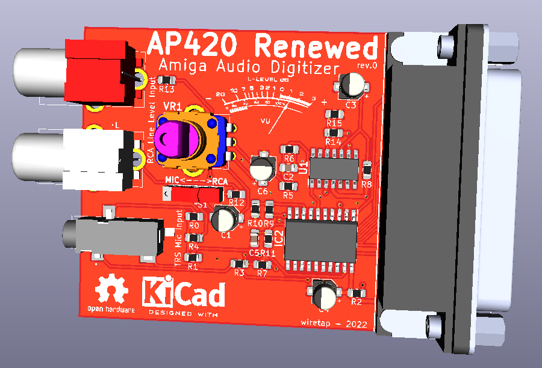

# AP420 Renewed Amiga Audio Digitizer
A remake of the Phoenix Microtechnologies AP420 with mono input and TRS microphone jack.

## Information
The schematic is per the PDF manual in the respository from the Phoenix Microtechnologies AP420. I added a second RCA jack so you can hook up stereo sound and it will be combined to a mono input. There's also an updated microphone jack that supports TRS 3.5mm and goes to a mono input. The selector switch on the board allows you to select between the RCA input and the microphone input. VR1 is a gain control knob for adjusting the strength of the audio signal.
\
\
The AP420 manual also goes into some detail in the notes section for performing component changes to allow for different audio sample rates at the expense of audio quality.
\
\
This device hooks up to the parallel port of of an Amiga 500, 600, 1000 (with adapter), 1200, 2000, 3000, and 4000. It does not require any external power.

## Misc
Not built and tested yet. Feel free to evaluate the circuit and provide any feedback.
